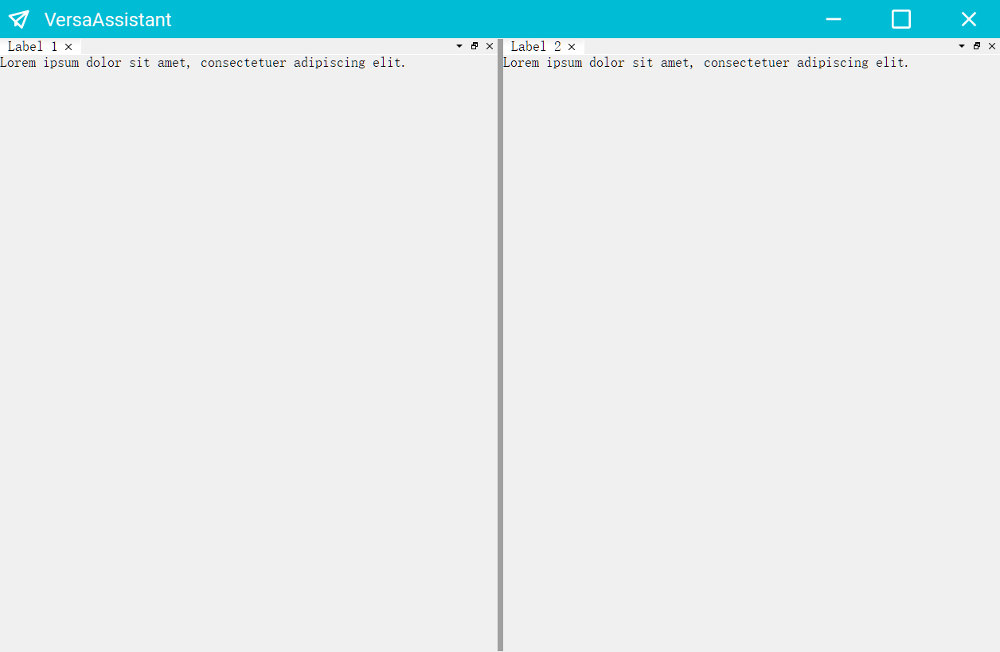

# VersaDebugAssistant

这是一个多功能调试助手的重构版本，将会对界面方面做一些优化，功能也将更加完善。

此版本刚启动不久，以前的项目请到 [https://github.com/vseasky/vsailorproject](https://github.com/vseasky/vsailorproject)

界面优化将会使用到

- [Qt-Advanced-Docking-System](https://github.com/githubuser0xFFFF/Qt-Advanced-Docking-System)
- [qt-material-widgets](https://github.com/laserpants/qt-material-widgets)

目前以及移植好相关的框架，后续继续更近

2024-6-2-如下效果代码，记录开发日常

